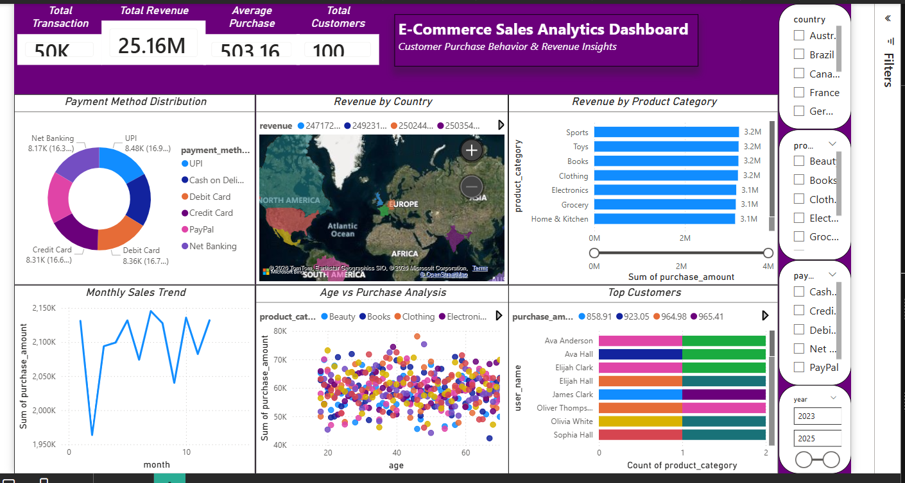

###### **E-Commerce Sales Analytics \& Customer Insights**

###### **Problem Statement**

E-commerce businesses generate large volumes of sales data but often struggle to extract actionable insights.

This project analyzes sales performance, customer behavior, and revenue trends to support data-driven business decisions.

###### **Dataset**

###### 

The dataset includes e-commerce transaction data such as:

\* Purchase Amount

\* Product Category

\* Payment Method

\* Customer Details

\* Country \& Region

\* Time (Monthly data)

###### **Tools \& Technologies**

\* Python (Pandas, NumPy)

\* Data Visualization (Matplotlib, Seaborn)

\* Dashboarding (Power BI)

\* Data Analysis \& KPI Tracking

###### **Project Workflow**

**1. Data Cleaning**

&#x20;  \* Handled missing values

&#x20;  \* Standardized categorical fields

**2. Data Analysis**

&#x20;  \* Revenue analysis by country

&#x20;  \* Product category performance

&#x20;  \* Customer purchase behavior

**3. KPI Tracking**

&#x20;  \* Total Transactions

&#x20;  \* Total Revenue

&#x20;  \* Average Purchase

&#x20;  \* Customer metrics

**4. Dashboard Development**

&#x20;  \* Built interactive dashboard with filters

&#x20;  \* Enabled dynamic analysis by country, category, payment method

###### **Key Insights (From Dashboard)**

**Revenue Performance**

\* Total revenue is 25M, indicating strong business scale

\* Monthly sales trend shows consistent performance with slight fluctuations

**Geographic Insights**

\* Revenue is distributed across multiple countries

\* Certain regions contribute significantly higher sales, indicating strong market presence

**Product Category Performance**

\* Categories like Sports, Toys, and Books generate high revenue

\* Product diversification supports consistent sales

**Payment Behavior**

\* Payment methods such as UPI, Credit Card, and Debit Card are widely used

\* Digital payment adoption is strong

**Customer Behavior**

\* Average purchase value is 503, indicating steady customer spending

\* Top customers contribute significantly to total revenue

**Demographic Insights**

\* Customers across different age groups show consistent purchasing patterns

\* No extreme dependency on a single age group

###### **Business Impact**

\* Helps businesses identify top-performing products and regions

\* Improves marketing strategy using customer insights

\* Enables better inventory and sales planning

\* Supports data-driven decision making

## 📸 Dashboard Preview

---

## 🎥 Demo Video

[Watch Demo](ecommerce.mp4)

###### **How to Run**

bash id="run999"

pip install -r requirements.txt

python main.py

###### **Future Improvements**

\* Add customer segmentation

\* Implement recommendation system

\* Forecast future sales using time-series models

\* Integrate real-time sales tracking

###### **Author**

Thiviyesh K

Aspiring Data Analyst 

